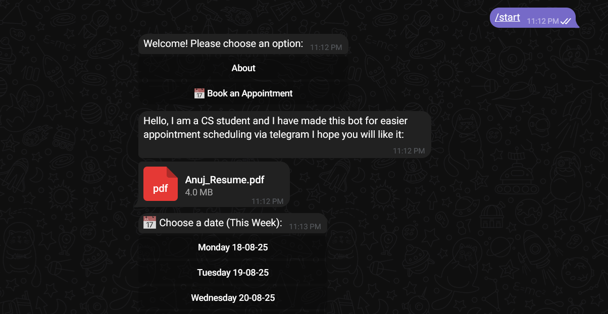
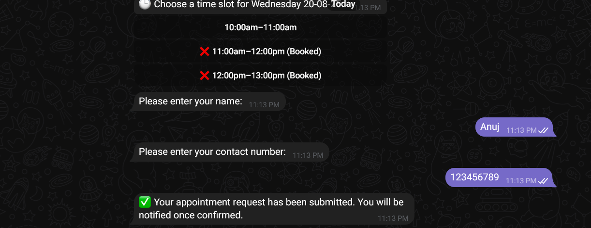

# Telegram-Bot-for-Appointments
I have made an Telegram bot for Appointments Which can be used for small businesses to automate their appoinment process. 

## API Used in this Projects

 - [Telegram Bot]( https://t.me/BotFather )
 - [Google cloud](https://cloud.google.com/)

These are the two APIs used for making this bot.

For Google cloud you will need to setup a project and enable GoogleSheets API and download your credential.json file.

Just keep your credential.json file in your Main/Root file along with bot.py

---------------------------------------------------------------

## Environment Variables

To run this project, you will need to add the following environment variables to your .env file

1) Telegram Bot token. You can find the Link above 👆

BOT_TOKEN = <Your bot token>

2) Admin chat id, This where you can accept, reject or reschedule the appointments.

ADMIN_CHAT_ID = your chat id 

Or you can directly mention it on line 12 in bot.py
## Feedback

If you have any feedback, please reach out to me 

[Instagram](https://www.instagram.com/anuj_26_v?igsh=cDdxd29ya2ZtMnpu)

[Discord]()

[Linkedin](https://www.linkedin.com/in/anuj-vishwakarma-a895a4364?utm_source=share&utm_campaign=share_via&utm_content=profile&utm_medium=android_app)

## Screenshots

## Screenshots

